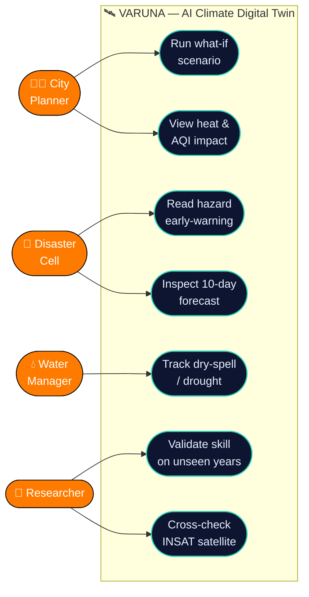
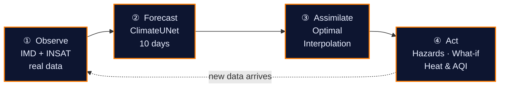

# 🛰️ VARUNA — Presentation Diagrams

**PPT-ready architecture, use-case and digital-twin diagrams.**
*ISRO Bharatiya Antariksh Hackathon (BAH) 2026 · Problem Statement #5 · Team Vandalizers*

> These diagrams are laid out in **landscape (16:9-friendly)** and colour-coded so each one
> screenshots cleanly straight into a slide. Open this file on GitHub, zoom to fit, and grab a
> screenshot of one diagram at a time.

---

## 1 · System Architecture

*National data → pre-processing → AI core → digital twin → applications. One left-to-right pipeline.*

```mermaid
flowchart LR
    subgraph S1["🛰️ National Data"]
        direction TB
        A1["IMD Rainfall<br/>0.25°"]
        A2["IMD Temp<br/>max / min"]
        A3["INSAT-3DR<br/>LST"]
    end
    subgraph S2["⚙️ Pre-processing"]
        direction TB
        B1["Regrid → 0.25°"]
        B2["Climatology<br/>(train years)"]
        B3["Anomaly cube<br/>+ land mask"]
    end
    subgraph S3["🧠 AI Core"]
        direction TB
        C1["ClimateUNet<br/>7.42M params"]
        C2["XGBoost<br/>ensemble"]
    end
    subgraph S4["🌍 Digital Twin"]
        direction TB
        D1["10-day<br/>forecast"]
        D2["OI<br/>assimilation"]
        D3["Hazard<br/>analytics"]
    end
    subgraph S5["📊 Applications"]
        direction TB
        E1["Climate<br/>Twin map"]
        E2["What-if:<br/>Heat & AQI"]
        E3["Validation<br/>& Skill"]
    end
    S1 --> S2 --> S3 --> S4 --> S5

    classDef src  fill:#1E5BFF,stroke:#04070f,color:#ffffff,stroke-width:1px;
    classDef pre  fill:#7E57C2,stroke:#04070f,color:#ffffff,stroke-width:1px;
    classDef ai   fill:#FF7B00,stroke:#04070f,color:#ffffff,stroke-width:1px;
    classDef twin fill:#2DD4BF,stroke:#04070f,color:#04263f,stroke-width:1px;
    classDef app  fill:#22D3EE,stroke:#04070f,color:#04263f,stroke-width:1px;
    class A1,A2,A3 src;
    class B1,B2,B3 pre;
    class C1,C2 ai;
    class D1,D2,D3 twin;
    class E1,E2,E3 app;
```

---

## 2 · Use-Case Diagram

*Who uses VARUNA and what they do with it — planners, disaster cells, water managers, researchers.*

---

## 3 · Digital-Twin Loop

*The living cycle — observe real data, forecast, assimilate observations back in, act, repeat.*

---

*VARUNA — Atmanirbhar climate intelligence on India's own data · Team Vandalizers*

